<p align="center">
    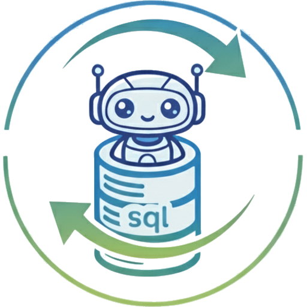
    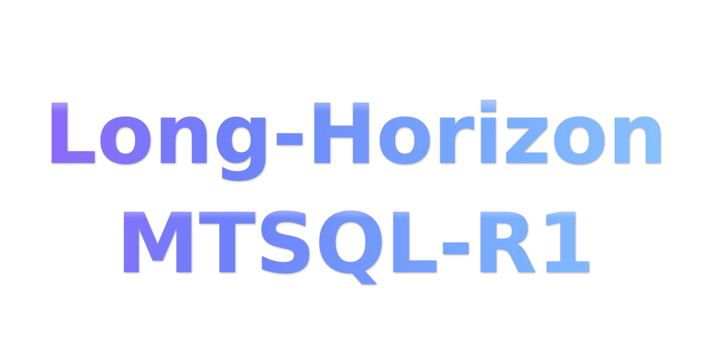
</p>

<p align="center">
  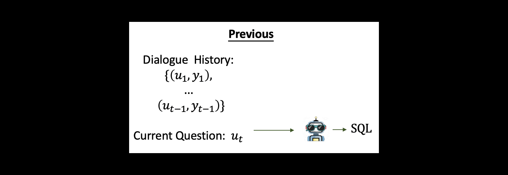
</p>


<p align="center">
    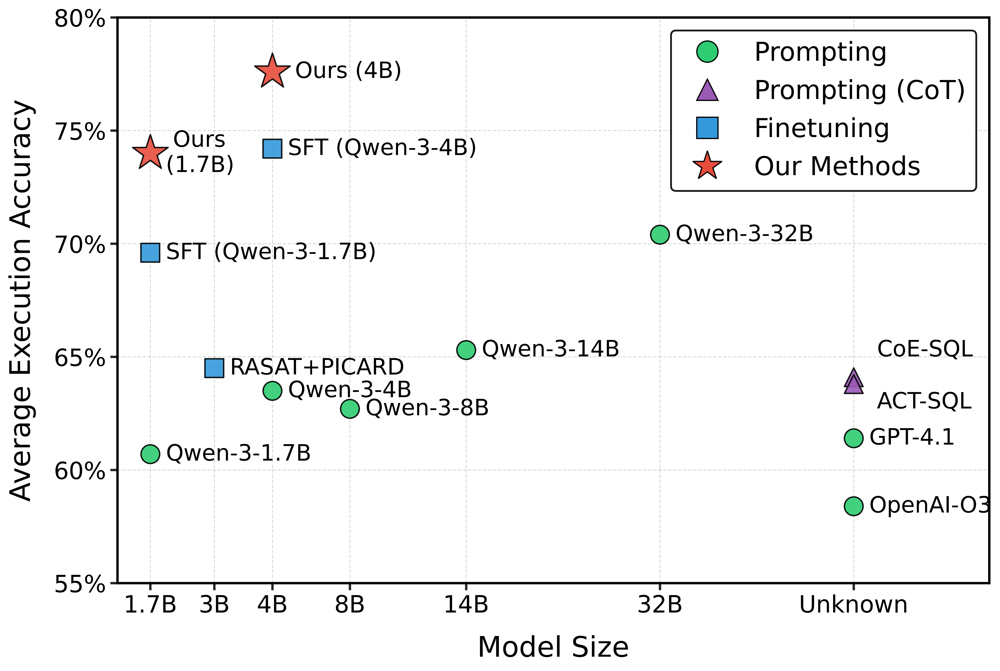
<p>


<p align="center">
 &nbsp&nbsp 📄 <a href="https://arxiv.org/abs/2510.12831">Arxiv</a>&nbsp&nbsp | &nbsp&nbsp🤗 <a href="">Hugging Face</a>&nbsp&nbsp 
 <p>

<div align="center">

| Resource | Link |
|----------|------|
| 🤗 MTSQL-R1 (4B) | MTSQL-R1(4B) (Will release after internal review) |
| 🤗 MTSQL-R1 (1.7B) | MTSQL-R1(1.7B) (Will release after internal review) |
| 🤗 Dataset | CoSQL-Long-Horizon-SFT-RL-Data (Will release after internal review) |
| 🤗 Dataset | SParC-Long-Horizon-SFT-RL-Data (Will release after internal review) |
| 💻 Code For SFT | Based on [LLaMA-Factory](https://github.com/hiyouga/LLaMA-Factory); see [Stage 1](#stage1-self-taught-warm-start-sft) |
| 💻 Code For RL  | This repository (built on [verl](https://github.com/volcengine/verl)); see [Stage 2](#stage2-end-to-end-long-horizon-reinforcement-learning) |

</div>

[](https://www.python.org/)


# 🚀 MTSQL-R1: Towards Long-Horizon Multi-Turn Text-to-SQL via Agentic Training


# 📋 Table of Contents

- [🌟 Highlights](#highlights)
- [📖 Introduction](#introduction)
- [⚙️ Installation](#installation)
- [📂 Repository Structure](#repo-structure)
- [🗄️ Data Preparation](#data-preparation)
- [🚀 Usage](#usage)
- [🔄 Training Framework](#training-framework)
  - [Stage1: Self-Taught Warm-Start SFT](#stage1-self-taught-warm-start-sft)
  - [Stage2: End-to-End Long-Horizon Reinforcement Learning](#stage2-end-to-end-long-horizon-reinforcement-learning)
- [📈 Training Dynamics](#training-dynamics)
- [📊 Experiment Results](#experiment-results)
  - [Overall Experiment Results](#-overall-experiment-results)
  - [Performance over different difficulties and turns](#performance-over-different-difficulties-and-turns)
  - [The evolution of different Long-Horizon Abilities](#the-evolution-of-different-long-horizon-abilities-and-related-execution-match-performance-for-4b-and-17b-model)
- [🙏 Acknowledgements](#acknowledgements)
- [📫 Contact](#contact)


<h1 id="highlights">🌟 Highlights</h1>

<div align="center">

| Category | Feature | Description |
|---------|---------|------------|
| Text-to-SQL | 🎯 Excellent in Solving **Long-Turn and Extra Hard** SQL Questions | 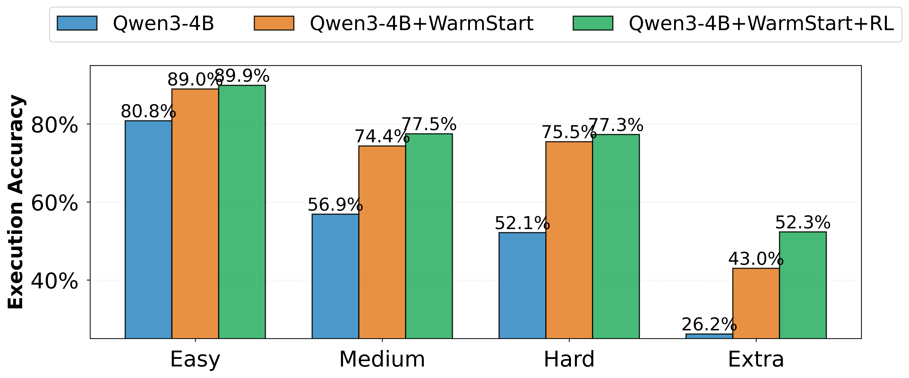   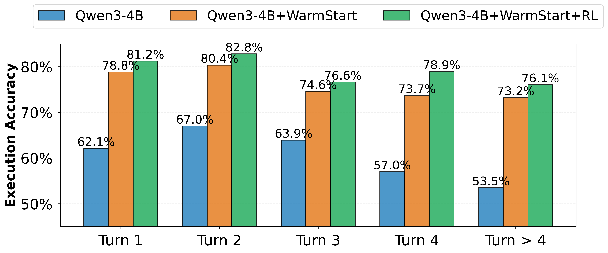 |
| Text-to-SQL | 🔄 Long-Horizon Formulation with Environment Feedback  | Leverages environment feedback through database execution and explicit memory verification to guide SQL generation and error correction |
| LLM Training | 🎓 **Two-Stage** Training Framework  | 1) **Tool-Integrated High-Quality SFT Dataset construction** by Self-Taught; Warm-Start SFT 2)**Curriculum RL Training** with **Multi-level rewards** (Outcome and Dense Process Reward) Design |
| LLM Training | 🔁 **Multi-Turn** End-to-End RL Training | Enables end-to-end training across multiple turns with database and memory to enhance coherence |

</div>

<h1 id="introduction">📖 Introduction</h1>
Short-horizon Text-to-SQL directly translates question to SQL, resulting execution erros and coherence-related erros.

Our approach enables:
- Environment-based verification: The model
interacts dynamically with two components: (i)
a database for execution feedback and (ii) a long-
term dialogue memory for explicit coherence
checking to verify intermediate SQL outputs.

- Self-correction: Based on verification feedback,
the model iteratively refines its generated SQL
queries to achieve consistent, executable outputs
across multiple turns.

- Autonomous End-to-End Learn actions (Propose, EXECUTE, Verify and Self-Correct) to generate better SQL.


<p align="center">
    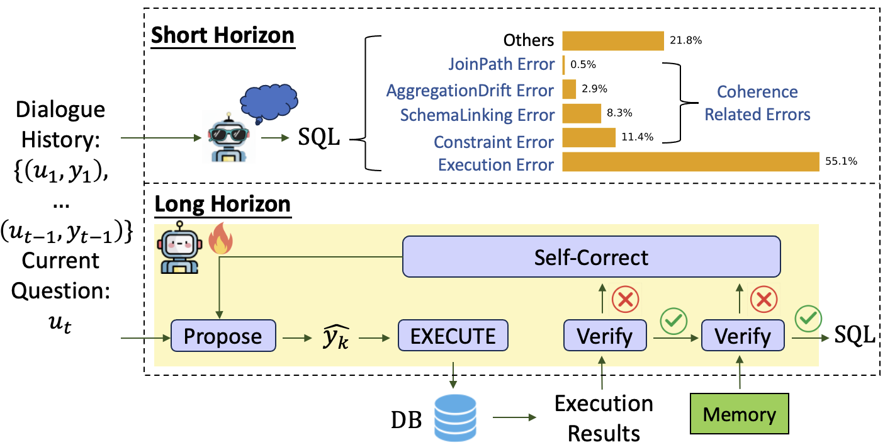
<p>


<h1 id="installation">⚙️ Installation</h1>

**Environment:**
- Python 3.10
- CUDA 12.4
- verl == 0.4.1
- LLaMA-Factory == 0.9.3 (used for Stage-1 SFT only)

**Install:**

```bash
# Clone the repository
git clone https://github.com/<your-org>/MTSQL-R1.git
cd MTSQL-R1

# (Recommended) create a clean Python 3.10 environment
conda create -n mtsql-r1 python=3.10 -y
conda activate mtsql-r1

# Install verl and runtime dependencies
pip install -r requirements.txt
# If running on CUDA GPUs, also install:
pip install -r requirements-cuda.txt
# If using the SGLang rollout backend:
pip install -r requirements_sglang.txt

# Install verl in editable mode
pip install -e .
```

For Stage-1 Self-Taught Warm-Start SFT, please install [LLaMA-Factory](https://github.com/hiyouga/LLaMA-Factory) separately in its own environment.


<h1 id="repo-structure">📂 Repository Structure</h1>

```
MTSQL-R1/
├── verl/                                # Core verl library (training / rollout / workers)
│   ├── trainer/                         # PPO / GRPO main entry points
│   ├── tools/eval/                      # SQL execution + evaluation tools
│   │   ├── exec_eval.py                 # Execute predicted SQL against a DB
│   │   └── evaluation.py                # Exact match / execution match scorer
│   ├── utils/reward_score/              # Reward functions used during RL
│   │   ├── text2sql.py                  # Outcome reward (execution match based)
│   │   ├── text2sql_exec.py             # Execution-match reward
│   │   ├── text2sql_exact.py            # Exact-match reward
│   │   └── text2sql_process.py          # Dense process reward (per-turn)
│   └── ...
├── examples/sglang_multiturn/
│   ├── config/
│   │   ├── text2sql_multiturn_grpo.yaml         # Main GRPO config for text2sql
│   │   └── tool_config/text2sql_tool_config.yaml # Tool definitions (DB exec, memory)
│   └── ...
├── run_text2sql.sh                      # Main RL training entry (outcome reward)
├── run_train_text2sql_process.sh        # RL training with dense process reward
├── run_generation_multiturn*.sh         # Rollout / trajectory generation
├── run_eval_text2sql*.sh                # Evaluation entries
├── run_model_convert.sh                 # Convert verl checkpoints to HuggingFace format
├── requirements*.txt
└── imgs/
```


<h1 id="data-preparation">🗄️ Data Preparation</h1>

**1. Download the CoSQL and SParC benchmarks** (databases + dialogues) from their original sources:
- CoSQL: https://yale-lily.github.io/cosql
- SParC: https://yale-lily.github.io/sparc

**2. Organize the SQLite databases** so the layout matches what the reward functions expect:

```
PATH/TO/database/
├── cosql/
│   └── database/
│       ├── concert_singer/concert_singer.sqlite
│       ├── car_1/car_1.sqlite
│       └── ...
└── sparc/
    └── database/
        └── ...
```

**3. Point the reward functions at your database directory.** The reward scripts in `verl/utils/reward_score/` contain a line like:

```python
# TODO: set to your local path to the CoSQL/SParC database directory
db_dir = f"PATH/TO/database/cosql/database/{db}"
```

Replace `PATH/TO/database` in the following files with your actual absolute path:
- `verl/utils/reward_score/text2sql.py`
- `verl/utils/reward_score/text2sql_exec.py`
- `verl/utils/reward_score/text2sql_exact.py`
- `verl/utils/reward_score/text2sql_process.py`
- `verl/utils/reward_score/eval/exec_eval.py`
- `verl/utils/reward_score/eval/evaluation.py`
- `verl/tools/eval/exec_eval.py`
- `verl/tools/eval/evaluation.py`

**4. Prepare training / evaluation `.parquet` files.** The training scripts expect data under `data/cosql/`, `data/sparc/` with files like `train_sft.parquet`, `test.parquet`, `enforce_sql_test.parquet`, etc. See the `DATA_FOLDER` variable at the top of each `run_*.sh` script.


<h1 id="usage">🚀 Usage</h1>

All entry points are shell scripts in the repo root. Before running, open the script and set `MODEL_PATH`, `DATA_FOLDER`, and `CUDA_VISIBLE_DEVICES` to match your environment.

**Stage-2 RL training (outcome reward):**
```bash
bash run_text2sql.sh
```

**Stage-2 RL training (dense process reward):**
```bash
bash run_train_text2sql_process.sh
```

**Rollout / trajectory generation (for Self-Taught data collection in Stage 1):**
```bash
bash run_generation_multiturn.sh          # default GRPO rollout
bash run_generation_multiturn_train.sh    # generate on train split
bash run_generation_multiturn_adddata.sh  # self-taught incremental rounds
bash run_generation_multiturn_lessgpu.sh  # smaller-GPU variant
```

**Evaluation:**
```bash
bash run_eval_text2sql.sh                  # RL checkpoint eval
bash run_eval_text2sql_baseline_long.sh    # long-horizon multi-turn baseline eval
bash run_eval_text2sql_baseline_short.sh   # short-form (single-turn) baseline eval
bash run_eval_multiturn.sh                 # multi-turn eval
```

**Convert trained verl checkpoint to HuggingFace format:**
```bash
bash run_model_convert.sh
```

> Tool and multi-turn behavior (DB execution, memory verification) is driven by `examples/sglang_multiturn/config/tool_config/text2sql_tool_config.yaml` and the GRPO recipe `examples/sglang_multiturn/config/text2sql_multiturn_grpo.yaml`.


<h1 id="training-framework">🔄 Training Framework</h1>

<p align="center">
    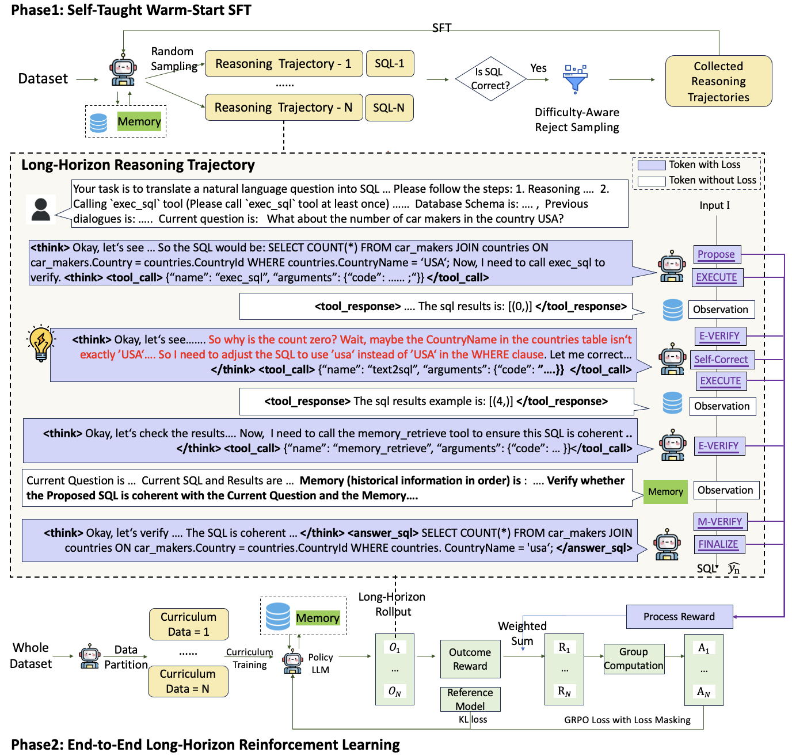
<p>

## Stage1: Self-Taught Warm-Start SFT 

- Step1: Random Sampling with high temperature for generating natural reasoning trajectories 
- Step2: Difficulty-Aware Reject Sampling
- Step3: SFT Model with Tool-Integrated Multi-Turn Trajectories and Loss Masking
- Step4: Update Dataset, Model and repeat

<p align="left">
    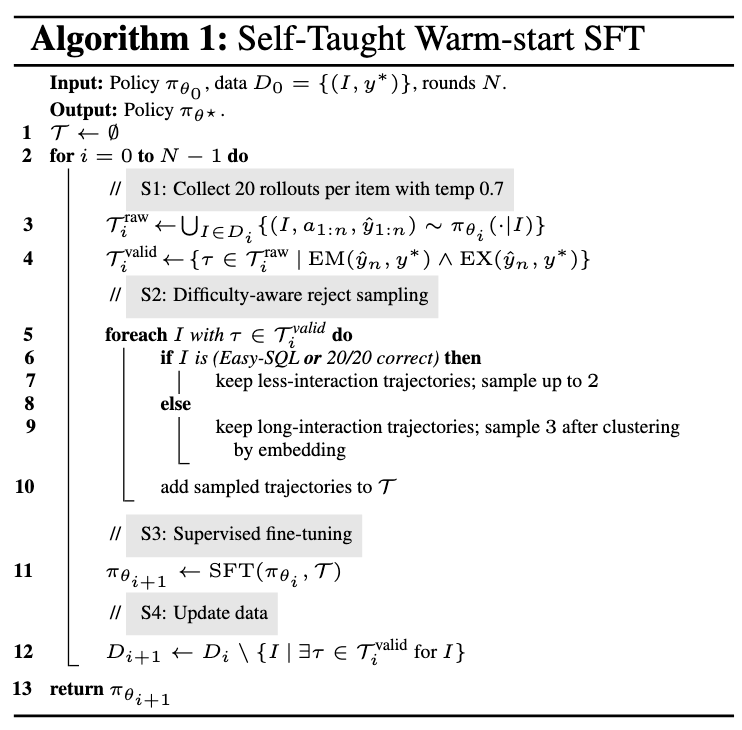
<p>


## Stage2: End-to-End Long-Horizon Reinforcement Learning

- Step1: Curriculum Data Partition by difficulty
- Step2: Outcome and Process Reward Design
- Step3: Multi-Turn RL with Loss Masking


<h1 id="training-dynamics">📈 Training Dynamics</h1>

The dynamics of Reward Score and Response Length During Training:

<p align="center">
  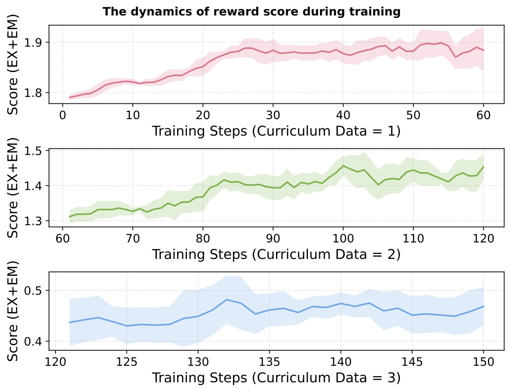
  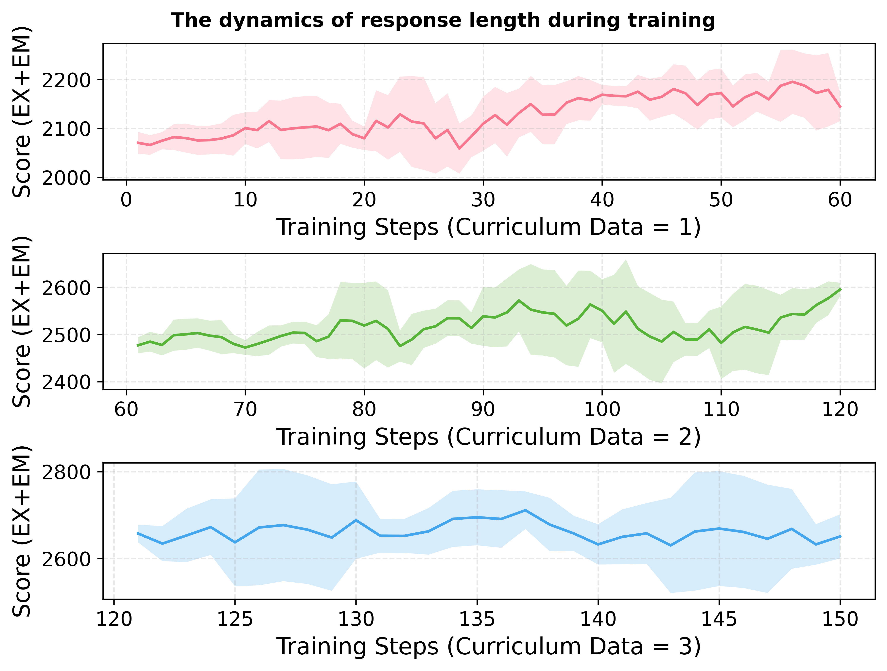
</p>

The dynamics of test score across different training checkpoints:

<p align="center">
    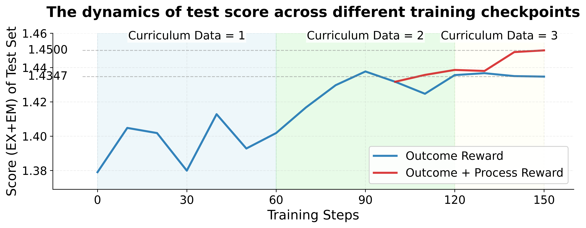
<p>


<h1 id="experiment-results">📊 Experiment Results</h1>

## Overall Experiment Results

Key Findings and Take Aways:

- Warm-start SFT and RL both provide gains in performance.
- Small LLMs (1.7B/4B) struggle to follow long-horizon function-calling instructions. 
- Conventional SFT attains good Exact Match but exhibits weaker logical consistency (Execution Match) while Long-Horizon archives better Execution Match.
- Long-horizon reasoning yields larger gains on multi-turn dialogues and complex questions.
- long-horizon RL substantially improves out-of-domain performance. 
- Process Dense Reward helps the model learn from harder examples, further boosting performance compared with sparse outcome-only rewards.
- Stronger function calling, verification, and self-correction correlate with better SQL performance.
- With long-horizon actions and training, the agent learns to resolve execution failures (even null-return cases - we call it **aha-moment** in Text-to-SQL) and coherence errors. 


<p align="center">
    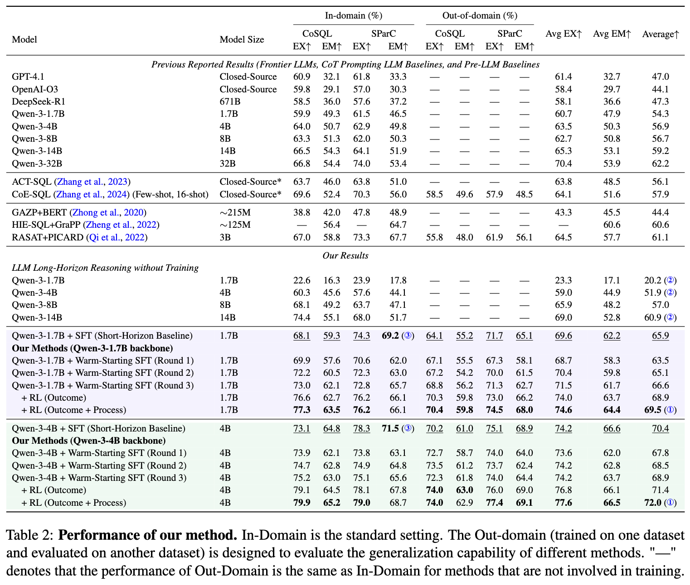
<p>


## Performance over different difficulties and turns

<p align="center">
  
  
</p>


## The evolution of different Long-Horizon Abilities and related Execution Match performance for 4B and 1.7B model

<p align="center">
  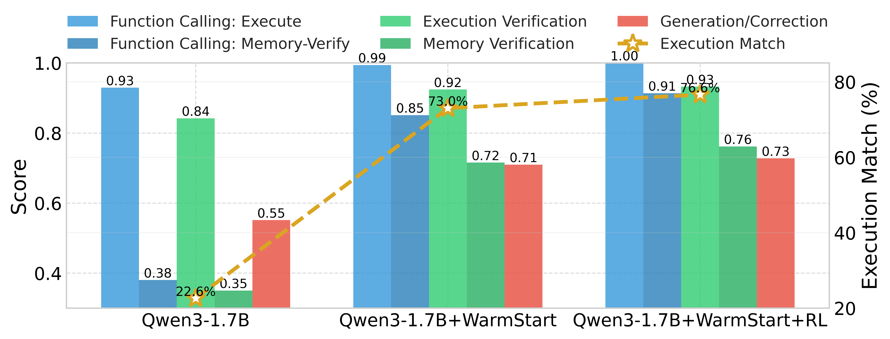
  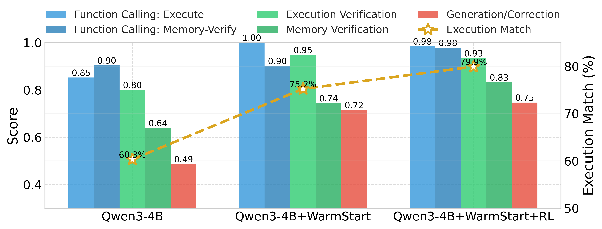
</p>


<h1 id="acknowledgements">🙏 Acknowledgements</h1>

We would like to express our gratitude to the open-source community for their valuable contributions:
- Verl:  https://github.com/volcengine/verl 
- LLamafactory: https://github.com/hiyouga/LLaMA-Factory 
- SGLang: https://github.com/sgl-project/sglang 
- VLLM: https://github.com/vllm-project/vllm 
- DB-GPT-Hub: https://github.com/eosphoros-ai/DB-GPT-Hub
- CoSQL: https://github.com/taoyds/cosql 
- SPaRC: https://github.com/taoyds/sparc
- Search-R1: https://github.com/PeterGriffinJin/Search-R1

......etc 


<h1 id="contact">📫 Contact</h1>

For any issues or discussion, please contact tguo2@nd.edu, thanks
