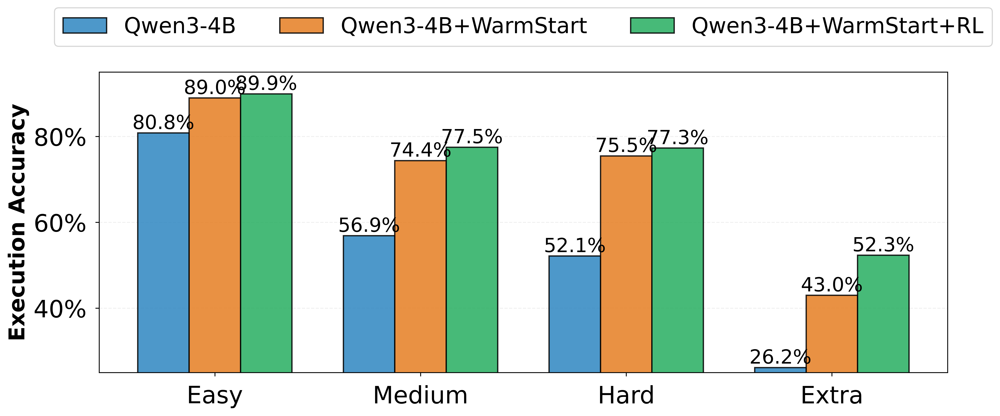

    
    Long-Horizon MTSQL-R1

  

    

 &nbsp&nbsp 📄 <a href="">Arxiv</a>&nbsp&nbsp | &nbsp&nbsp🤗 <a href="">Hugging Face</a>&nbsp&nbsp 
 

| Resource | Link |
|----------|------|
| 🤗 MTSQL-R1 (4B) | MTSQL-R1(4B) (Will release after internal review) |
| 🤗 MTSQL-R1 (1.7B) | MTSQL-R1(1.7B) (Will release after internal review) |
| 🤗 Dataset | CoSQL-Long-Horizon-SFT-RL-Data (Will release after internal review) |
| 🤗 Dataset | SParC-Long-Horizon-SFT-RL-Data (Will release after internal review) |

# 🚀 MTSQL-R1: Towards Long-Horizon Multi-Turn Text-to-SQL via Agentic Training

# 📋 Table of Contents

- [🌟 Highlights](#highlights)
- [📖 Introduction](#introduction)
- [⚙️ Configuration](#configuration)
- [🔄 Training Framework](#training-framework)
  - [Stage1: Self-Taught Warm-Start SFT](#stage1-self-taught-warm-start-sft)
  - [Stage2: End-to-End Long-Horizon Reinforcement Learning](#stage2-end-to-end-long-horizon-reinforcement-learning)
- [📈 Training Dynamics](#training-dynamics)
- [📊 Experiment Results](#experiment-results)
  - [Overall Experiment Results](#-overall-experiment-results)
  - [Performance over different difficulties and turns](#performance-over-different-difficulties-and-turns)
  - [The evolution of different Long-Horizon Abilities](#the-evolution-of-different-long-horizon-abilities-and-related-execution-match-performance-for-4b-and-17b-model)
- [🙏 Acknowledgements](#acknowledgements)
- [📫 Contact](#contact)

<h1 id="highlights">🌟 Highlights</h1>

| Category | Feature | Description |
|---------|---------|------------|
| Text-to-SQL | 🯠Excellent in Solving **Long-Turn and Extra Hard** SQL Questions |     |
| Text-to-SQL | 🔄 Long-Horizon Formulation with Environment Feedback  | Leverages environment feedback through database execution and explicit memory verification to guide SQL generation and error correction |
| LLM Training | 🎓 **Two-Stage** Training Framework  | 1) **Tool-Integrated High-Quality SFT Dataset construction** by Self-Taught; Warm-Start SFT 2)**Curriculum RL Training** with **Multi-level rewards** (Outcome and Dense Process Reward) Design |
| LLM Training | 🔁 **Multi-Turn** End-to-End RL Training | Enables end-to-end training across multiple turns with database and memory to enhance coherence |

<h1 id="introduction">📖 Introduction</h1>
Short-horizon Text-to-SQL directly translates question to SQL, resulting execution erros and coherence-related erros.

Our approach enables:
- Environment-based verification: The model
interacts dynamically with two components: (i)
a database for execution feedback and (ii) a long-
term dialogue memory for explicit coherence
checking to verify intermediate SQL outputs.

- Self-correction: Based on verification feedback,
the model iteratively refines its generated SQL
queries to achieve consistent, executable outputs
across multiple turns.

- Autonomous End-to-End Learn actions (Propose, EXECUTE, Verify and Self-Correct) to generate better SQL.

    

<h1 id="configuration">⚙️ Configuration</h1>
Verl == 0.4.1

LLamafactory == 0.9.3

<h1 id="training-framework">🔄 Training Framework</h1>

    

## Stage1: Self-Taught Warm-Start SFT 

- Step1: Random Sampling with high temperature for generating natural reasoning trajectories 
- Step2: Difficulty-Aware Reject Sampling
- Step3: SFT Model with Tool-Integrated Multi-Turn Trajectories and Loss Masking
- Step4: Update Dataset, Model and repeat

    

## Stage2: End-to-End Long-Horizon Reinforcement Learning

- Step1: Curriculum Data Partition by difficulty
- Step2: Outcome and Process Reward Design
- Step3: Multi-Turn RL with Loss Masking

<h1 id="training-dynamics">📈 Training Dynamics</h1>

The dynamics of Reward Score and Response Length During Training:

  
  

The dynamics of test score across different training checkpoints:

    

<h1 id="experiment-results">📊 Experiment Results</h1>

## Overall Experiment Results

Key Findings and Take Aways:

- Warm-start SFT and RL both provide gains in performance.
- Small LLMs (1.7B/4B) struggle to follow long-horizon function-calling instructions. 
- Conventional SFT attains good Exact Match but exhibits weaker logical consistency (Execution Match) while Long-Horizon archives better Execution Match.
- Long-horizon reasoning yields larger gains on multi-turn dialogues and complex questions.
- long-horizon RL substantially improves out-of-domain performance. 
- Process Dense Reward helps the model learn from harder examples, further boosting performance compared with sparse outcome-only rewards.
- Stronger function calling, verification, and self-correction correlate with better SQL performance.
- With long-horizon actions and training, the agent learns to resolve execution failures (even null-return cases - we call it **aha-moment** in Text-to-SQL) and coherence errors. 

    

## Performance over different difficulties and turns

  
  

## The evolution of different Long-Horizon Abilities and related Execution Match performance for 4B and 1.7B model

  
  

<h1 id="acknowledgements">🙏 Acknowledgements</h1>

We would like to express our gratitude to the open-source community for their valuable contributions:
- Verl:  https://github.com/volcengine/verl 
- LLamafactory: https://github.com/hiyouga/LLaMA-Factory 
- SGLang: https://github.com/sgl-project/sglang 
- VLLM: https://github.com/vllm-project/vllm 
- DB-GPT-Hub: https://github.com/eosphoros-ai/DB-GPT-Hub
- CoSQL: https://github.com/taoyds/cosql 
- SPaRC: https://github.com/taoyds/sparc
- Search-R1: https://github.com/PeterGriffinJin/Search-R1

......etc 

<h1 id="contact">📫 Contact</h1>

For any issues or discussion, please contact tguo2@nd.edu, thanks
